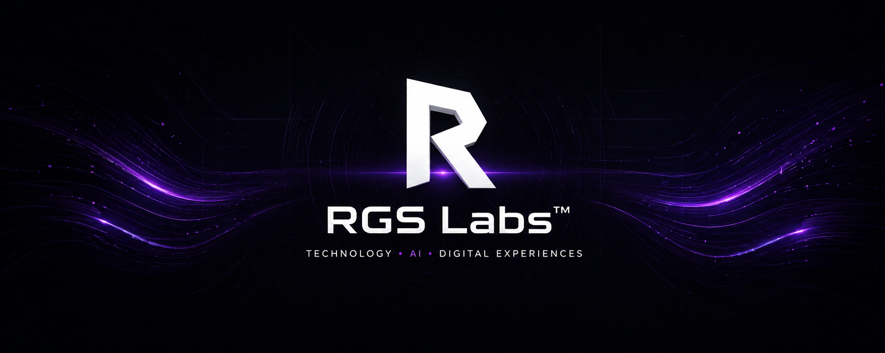
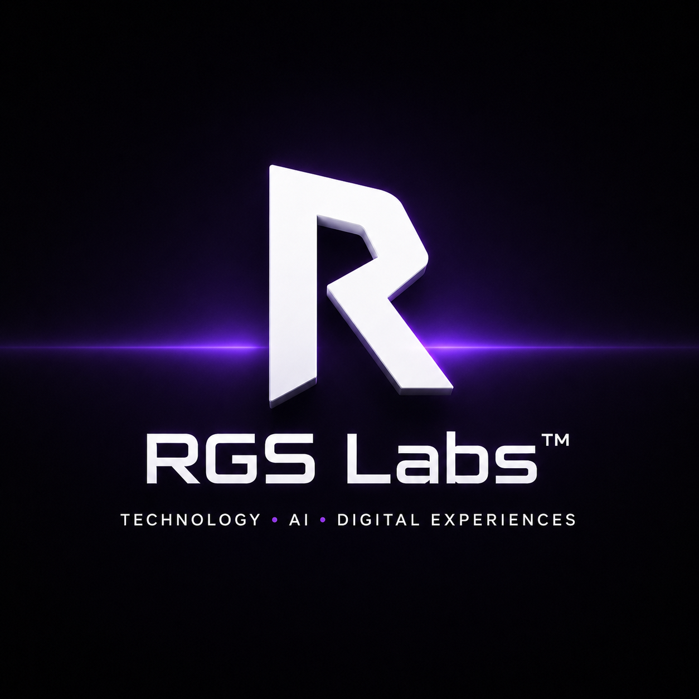

Currently building

HELIOS • DataForge CLI • The future of RGS Labs™

 

# RGS Labs™

### Building technology people genuinely enjoy using

Independent software lab focused on creating modern AI tools,
immersive games and premium digital experiences.

 

  

---

> ### ⚡ "We don't just build software. We build tools people genuinely enjoy using."

# 🚀 About RGS Labs™

RGS Labs™ is an independent technology studio focused on building software that solves real problems while delivering polished user experiences.

Our work combines **Artificial Intelligence**, **developer tools**, **interactive web technologies** and **game development** into products designed to be useful, intuitive and enjoyable to use.

Rather than chasing trends, every project is built around three core principles:

- ⚡ **Fast** — lightweight tools with minimal friction.
- 🔒 **Local-first** — privacy and user control always come first.
- 🎯 **Professional** — clean architecture, maintainable code and thoughtful design.

> Build technology people genuinely enjoy using.

---

# 👋 About Me

Hi!

I'm the founder of RGS Labs™, an independent technology brand focused on building AI tools, developer software, modern websites and digital experiences.

Although RGS Labs is presented as a technology brand, behind every repository is simply a curious developer who enjoys creating useful software and constantly learning.

> [!NOTE]
>
> I'm currently 15 years old.
>
> Everything published here has been built while learning, experimenting and continuously improving.
>
> This isn't the end of the journey—
> it's only the beginning.

I believe software should be elegant, practical and enjoyable to use.

Everything published here follows the same philosophy:

Build products people actually enjoy using.

---

### 🧠 Current Focus

RGS Labs is currently investing most of its development time into building an ecosystem of modern software products, including:

- 🤖 Artificial Intelligence tools
- 💻 Developer productivity software
- 🌐 Modern web experiences
- 🎮 Immersive indie games
- ⚙️ Automation systems
- 🧩 Experimental technologies
- 🚧 SaaS **(Future)**
- 🚧 Desktop Applications **(Future)**
- 🚧 Open Source Ecosystem **(Future)**

Every repository published here represents a real project under active development.

Some are experimental.

Some become production-ready products.

All of them are opportunities to learn, improve and push RGS Labs one step further.

---

### 💡 Philosophy

Great technology shouldn't feel complicated.

It should feel invisible.

The best software isn't the one with the most features.

It's the one users enjoy opening every day.

That philosophy guides every decision made at RGS Labs™.

> [!NOTE]
>
> **RGS Labs™ is currently a solo studio.**
>
> Every repository, design, line of code and experiment published here is developed independently as part of a long-term vision of building a modern technology brand.

---

# 🚀 Featured Projects

These are the projects currently driving the RGS Labs™ ecosystem.

Each one focuses on solving a different problem while following the same philosophy:

> **Local-first • Fast • Professional**

 

<table>

<tr>

<td width="50%">

### 🛠️ DataForge CLI

**AI-powered toolkit for developers**

Analyze, understand and document complex projects directly from your terminal using Groq-powered AI.

**Highlights**

- 🤖 AI-powered analysis
- 📂 Project scanning
- 📄 Documentation generation
- 🗺️ Architecture visualization
- 💻 Cross-platform CLI

**Tech**

`Python` `Groq API`

 

</td>

<td width="50%">

</td>

</tr>

</table>

---

<table>

<tr>

<td width="50%">

</td>

<td width="50%">

### 🤖 RabAI

**AI platform by RGS Labs**

A web-based AI assistant designed to provide accessible artificial intelligence through an intuitive interface.

**Highlights**

- 💬 AI conversations
- 🌐 Web platform
- ⚡ Fast responses
- 🎯 Clean interface

**Tech**

`HTML`

 

</td>

</tr>

</table>

---

<table>

<tr>

<td width="50%">

### 🌐 RGS Labs Website

The official website of RGS Labs™.

Designed as the digital home of every project developed inside the ecosystem.

**Highlights**

- ⚡ Lightweight
- 🎨 Modern design
- 📱 Responsive
- 🌍 GitHub Pages

**Tech**

`HTML`
`CSS`
`JavaScript`

 

</td>

<td width="50%">

</td>

</tr>

</table>

---

<table>

<tr>

<td width="50%">

</td>

<td width="50%">

# 🚧 HELIOS (Internal AI platform for the RGS Labs™ ecosystem.)

### Coming Soon

The next-generation AI ecosystem currently under development.

Designed to become the flagship intelligent assistant for RGS Labs™.

**Status**

🟡 In Development

</td>

</tr>

</table>

---

# 📈 Development Activity

Every repository at **RGS Labs™** evolves continuously through experimentation, iteration and long-term development.

This profile is actively maintained, with projects receiving regular improvements, new features and documentation updates.

 

 

---

# 💻 Technologies

---

## 🧠 Currently Learning

RGS Labs™ believes that continuous learning is one of the most valuable engineering skills.

Current areas of exploration include:

- 🤖 Artificial Intelligence Systems
- 🧩 Software Architecture
- ⚙️ Automation & Productivity
- 🌐 Full Stack Development
- 🎮 Game Development
- 📊 UI / UX Design
- 🛠️ DevOps Fundamentals

---

# 🌍 Our Vision

My long-term vision is simple:

Build an ecosystem where AI, software and design work together naturally.

Not just websites.

Not just applications.

Complete digital ecosystems.

Whether it's an AI developer tool, a website, an automation workflow or an indie horror game, our mission remains the same:

- Build tools that save time.
- Design experiences people remember.
- Keep technology accessible.
- Never stop improving.

> [!IMPORTANT]
>
> **We're not trying to build more software.**
>
> **We're trying to build better software.**

---

# 👋 Behind RGS Labs

Although RGS Labs™ is presented as an independent technology brand, behind every repository is simply a curious developer who enjoys building things.

I started exploring programming because I loved creating ideas that didn't exist yet.

Since then, that curiosity has grown into websites, AI tools, automation systems, open-source projects and indie game development.

Today, every project I publish is another opportunity to learn, improve and share that journey with others.

---

> [!NOTE]
>
> I believe age has very little to do with what someone is capable of building.
>
> Passion, consistency and curiosity matter far more.

---

If you're another student, developer or creator who wants to build meaningful things—

keep going.

Everyone starts somewhere.

Maybe this profile is the proof that you don't have to wait to begin.

### 🚀 Build today.
### Learn tomorrow.
### Keep building.

P.S.

I'm still a student.

Everything you see here has been built while learning,
experimenting and making mistakes.

If I can build this today...

imagine what comes next.

---

### Thanks for stopping by.

Every repository above started as an idea.

Today they're becoming products.

Tomorrow they'll become something bigger.

⭐ If something here inspired you,
consider following the journey.

See you in the next commit.

---

## RGS Labs™

### Building technology people genuinely enjoy using.

 

*"One commit closer to the future."*

