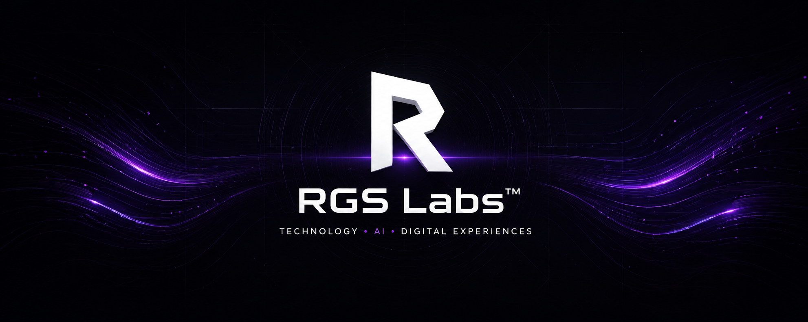
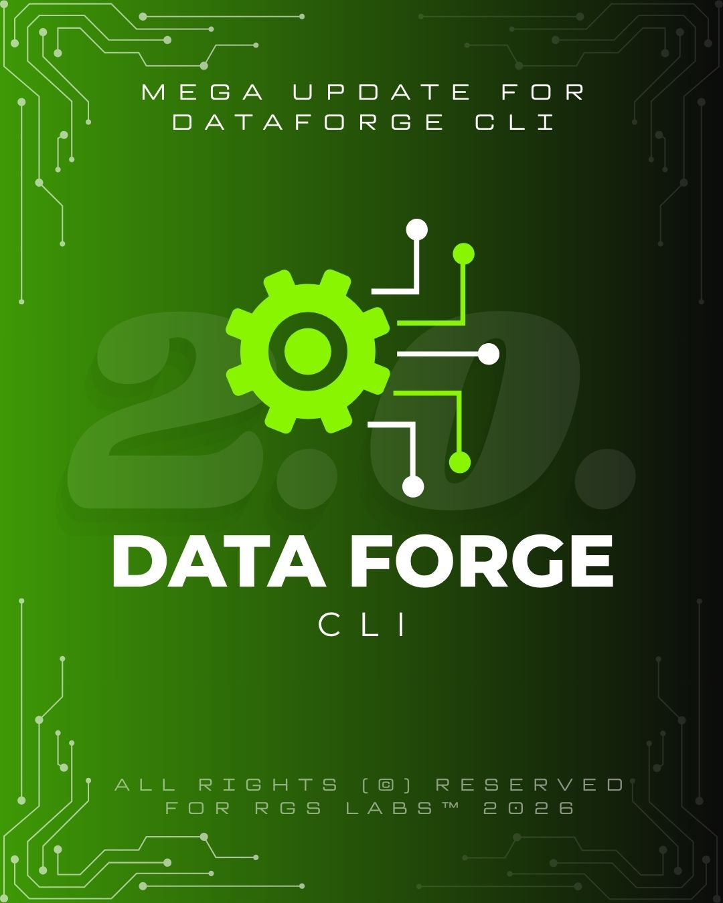
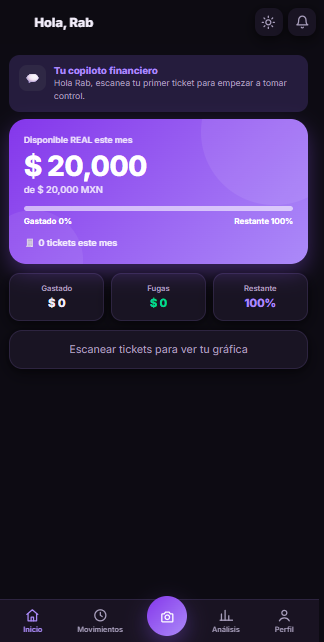
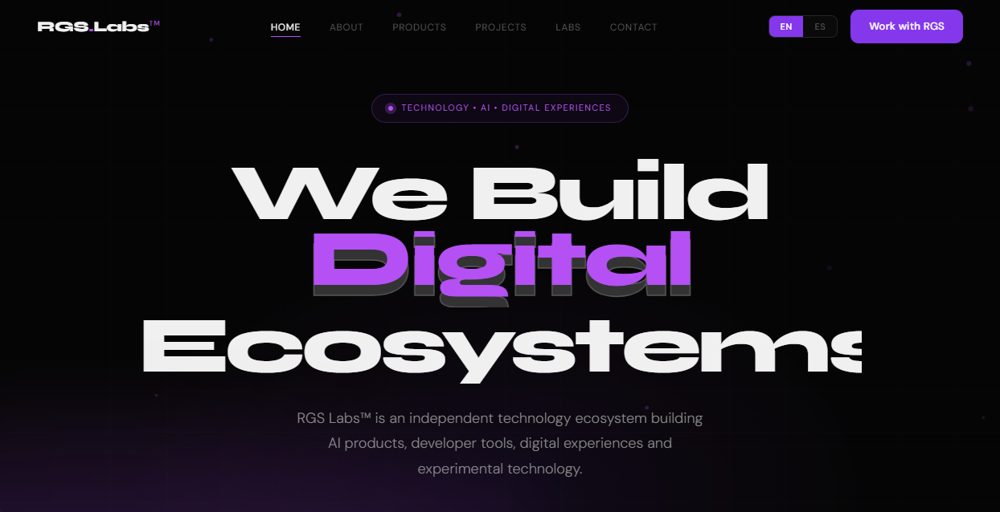
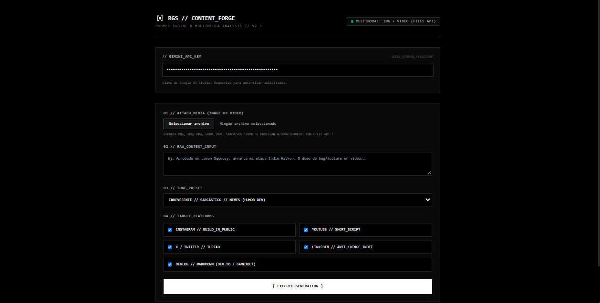
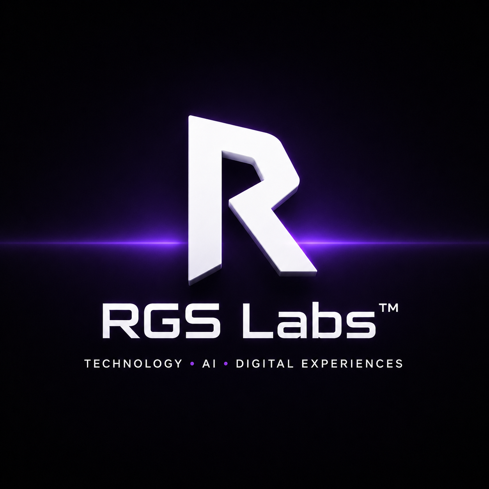

<div align="center">

  

  <br><br>

  <h1>⚡ RGS Labs™</h1>
  <h3><i>Building technology people genuinely enjoy using.</i></h3>

  <p>
    <b>Independent Software Studio</b> • Artificial Intelligence • Developer Tools • Interactive Web • Game Development
  </p>

  <p align="center">
    <code>HELIOS</code> • <code>DataForge CLI</code> • <code>MyTicket</code> • <code>The Future of RGS Labs™</code>
  </p>

  <br>

  <!-- Navigation & Social Badges -->
  <a href="https://rabbitgamesdev.github.io/RGS-Labs/">
    
  </a>
  <a href="https://www.instagram.com/rgs_labs/">
    
  </a>
  <a href="mailto:rgslabs.contact@gmail.com">
    
  </a>
  <a href="https://github.com/RabbitGamesDev">
    
  </a>

  <br><br>

  <!-- Realtime Profile Stats Badges -->
  
  
  

</div>

<br>

> [!TIP]
> ### ⚡ "We don't just build software. We build tools people genuinely enjoy using."

---

## 🚀 About RGS Labs™

**RGS Labs™** is an independent technology studio focused on building software that solves real problems while delivering polished user experiences.

Our work combines **Artificial Intelligence**, **developer tools**, **interactive web technologies**, and **game development** into products designed to be useful, intuitive, and enjoyable to use.

Rather than chasing trends, every project is built around three core principles:

- ⚡ **Fast** — Lightweight tools with minimal friction.
- 🔒 **Local-first** — Privacy and user control always come first.
- 🎯 **Professional** — Clean architecture, maintainable code, and thoughtful design.

---

## 👋 About Me

Hi! I'm the founder of **RGS Labs™**, an independent technology brand focused on building AI tools, developer software, modern websites, and digital experiences.

Although RGS Labs is presented as a technology brand, behind every repository is simply a curious developer who enjoys creating useful software and constantly learning.

> [!NOTE]
> **Age Context & Vision**
> - 🎓 Currently **15 years old**.
> - 🛠️ Everything published here has been built while learning, experimenting, and continuously improving.
> - 🚀 This isn't the end of the journey — *it's only the beginning.*

I believe software should be elegant, practical, and enjoyable to use. Everything published here follows the same philosophy: **Build products people actually enjoy using.**

<br>

<details>
<summary><b>🧠 Current Development Focus & Future Roadmap (Click to expand)</b></summary>

<br>

RGS Labs is currently investing most of its development time into building an ecosystem of modern software products, including:

* 🤖 **Artificial Intelligence tools**
* 💻 **Developer productivity software**
* 🌐 **Modern web experiences**
* 🎮 **Immersive indie games**
* ⚙️ **Automation systems**
* 🧩 **Experimental technologies**
* 🚧 **SaaS** *(Future)*
* 🚧 **Desktop Applications** *(Future)*
* 🚧 **Open Source Ecosystem** *(Future)*

Every repository published here represents a real project under active development. Some are experimental, some become production-ready products, but all of them are opportunities to learn, improve, and push RGS Labs one step further.

</details>

---

## 💡 Philosophy

Great technology shouldn't feel complicated. **It should feel invisible.**

The best software isn't the one with the most features. It's the one users enjoy opening every day. That philosophy guides every decision made at RGS Labs™.

> [!NOTE]
> **RGS Labs™ is currently a solo studio.**
> Every repository, design, line of code, and experiment published here is developed independently as part of a long-term vision of building a modern technology brand.

---

# 🚀 Featured Projects

These are the projects currently driving the RGS Labs™ ecosystem. Each one focuses on solving a different problem while following our core principles: **Local-first • Fast • Professional**.

<br>

<table>
<tr>
<td width="50%">

### 🛠️ DataForge CLI
**AI-powered toolkit for developers**

Analyze, understand, and document complex projects directly from your terminal using Groq-powered AI.

**Highlights**
- 🤖 AI-powered project analysis
- 📂 Automated codebase scanning
- 📄 Dynamic documentation generation
- 🗺️ Architecture visualization
- 💻 Cross-platform CLI interface

**Tech Stack**<br>


<br>

<a href="https://rabbitgamesdev.github.io/DataForge-CLI_Website/">
  
</a>
<a href="https://github.com/RabbitGamesDev/DataForge-CLI">
  
</a>

</td>
<td width="50%" align="center">
  
</td>
</tr>
</table>

---

<table>
<tr>
<td width="50%" align="center">
  
</td>
<td width="50%">

### 🧾 MyTicket
**Smart Receipt & Family Finance Management PWA**

A mobile-first progressive web app built to transform family financial management by eliminating friction, tracking invisible spending, and revealing true available income.

**Highlights**
- 📸 Camera & photo receipt scanning
- 💵 Real Available Money calculation
- 🔍 Invisible Leaks Radar (*"Fugas Invisibles"*)
- 🚨 Debt Rescue Route mapping
- 🤖 Contextual personalized AI coach

**Tech Stack**<br>


<br>

<a href="https://github.com/RabbitGamesDev/MyTicket-Repo">
  
</a>

</td>
</tr>
</table>

---

<table>
<tr>
<td width="50%">

### 🌐 RGS Labs Website
**The Official Home of RGS Labs™**

Designed as the digital hub of every project developed inside the ecosystem.

**Highlights**
- ⚡ Ultra-lightweight performance
- 🎨 Modern & clean UI/UX design
- 📱 Fully responsive experience
- 🌍 Hosted on GitHub Pages

**Tech Stack**<br>


<br>

<a href="https://rabbitgamesdev.github.io/RGS-Labs/">
  
</a>
<a href="https://github.com/RabbitGamesDev/RGS-Labs">
  
</a>

</td>
<td width="50%" align="center">
  
</td>
</tr>
</table>

---

<table>
<tr>
<td width="50%" align="center">
  
</td>
<td width="50%">

### ⚡ RGS Content Forge — Multimodal Edition
**Zero-Backend Content Engine by RGS Labs**

A lightweight multimodal prompt engine that transforms screenshots, code, and videos into tailored social media content while preserving an authentic devlog voice.

**Highlights**
- 📸 Multi-Format processing (Images, Code, Videos)
- 🎯 Platform-targeted outputs (X, IG, LinkedIn, Devlog)
- ⚡ Live in-card content refinement
- 🔑 100% Client-side with local API key storage

**Tech Stack**<br>


<br>

<a href="https://github.com/RabbitGamesDev/RGS-CONTENT_FORGE">
  
</a>

</td>
</tr>
</table>

---

# 📈 Development Activity

Every repository at **RGS Labs™** evolves continuously through experimentation, iteration, and long-term development. This profile is actively maintained with regular updates.

<br>

<div align="center">

  
  

  <br><br>

  

</div>

---

# 💻 Technologies & Stack

<div align="center">

  <!-- Core Tools via Skillicons -->
  

  <br><br>

  <!-- AI Models & APIs Custom Badges -->
  
  
  
  

</div>

<br>

### 🧠 Currently Learning

Current focus areas of ongoing study and continuous improvement:

```
┌─────────────────────────────────────────────────────────────────────────┐
│  🤖 Artificial Intelligence Systems    •  🧩 Software Architecture     │
│  ⚙️ Automation & Productivity         •  🌐 Full Stack Development     │
│  🎮 Game Development                   •  📊 UI / UX Design            │
│  🛠️ DevOps Fundamentals                                                │
└─────────────────────────────────────────────────────────────────────────┘
```

---

# 🌍 Our Vision

My long-term vision is simple: **Build an ecosystem where AI, software, and design work together naturally.**

Not just websites. Not just applications. **Complete digital ecosystems.**

Whether it's an AI developer tool, a website, an automation workflow, or an indie horror game, our mission remains the same:

- ⚡ **Build tools that save time.**
- 🎨 **Design experiences people remember.**
- 🔓 **Keep technology accessible.**
- 📈 **Never stop improving.**

> [!IMPORTANT]
> **We're not trying to build more software.**
> **We're trying to build better software.**

---

# 👋 Behind RGS Labs

Although RGS Labs™ is presented as an independent technology brand, behind every repository is simply a curious developer who enjoys building things.

I started exploring programming because I loved creating ideas that didn't exist yet. Since then, that curiosity has grown into websites, AI tools, automation systems, open-source projects, and indie game development.

> [!NOTE]
> I believe age has very little to do with what someone is capable of building.
> **Passion, consistency, and curiosity matter far more.**

If you're another student, developer, or creator who wants to build meaningful things — **keep going.** Everyone starts somewhere. Maybe this profile is proof that you don't have to wait to begin.

<div align="center">

  <h3>🚀 Build today. Learn tomorrow. Keep building.</h3>

  > **P.S.** I'm still a student. Everything you see here has been built while learning, experimenting, and making mistakes.
  > 
  > *If I can build this today... imagine what comes next.*

</div>

---

<div align="center">

  ### Thanks for stopping by! 👋

  Every repository above started as an idea. Today they're becoming products. Tomorrow they'll become something bigger.

  ⭐ **If something here inspired you, consider following the journey.**

  *See you in the next commit.*

  <br>

  

  ### **RGS Labs™**
  *Building technology people genuinely enjoy using.*

  <br>

  `"One commit closer to the future."`

</div>
